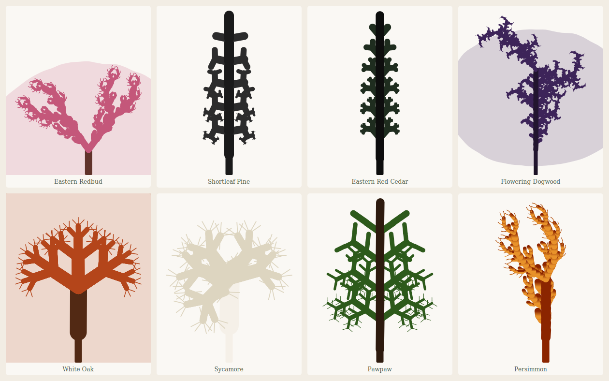
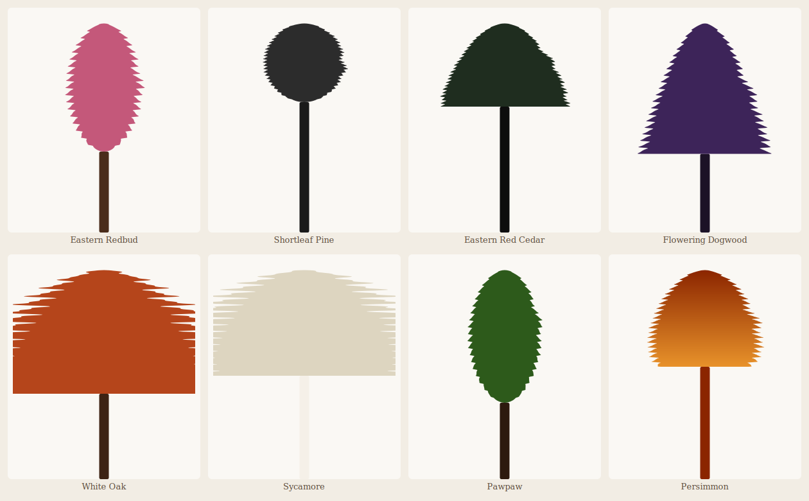

# dendra

Generate mathematically-driven SVG silhouettes of NW Arkansas native trees.



```bash
dendra generate redbud    --palette spring-bloom       --seed 2
dendra generate pine      --palette winter-silhouette
dendra generate cedar     --palette ink-wash           --seed 3
dendra generate dogwood   --palette ozark-dusk         --seed 1
dendra generate white-oak --palette ozark-autumn       --seed 5
dendra generate sycamore  --palette bare-bones         --seed 2
dendra generate pawpaw    --palette summer-canopy      --seed 4
dendra generate persimmon --gradient '#8b2500:#e8922a:vertical' --seed 1
```

Each tree is built from three layered math systems: an **L-system** defines the branching structure, **wave harmonics** modulate branch angles based on a musical note, and **Perlin noise** drifts segment endpoints for organic irregularity. Deciduous species optionally get a **Fourier crown envelope** overlay.

## Species

| Slug | Species | Math engine |
|---|---|---|
| `redbud` | Eastern Redbud | L-system + Fourier vase crown |
| `pine` | Shortleaf Pine | Central-leader A/B L-system |
| `white-oak` | White Oak | L-system + Fourier dome |
| `dogwood` | Flowering Dogwood | L-system + Fourier tiered crown |
| `cedar` | Eastern Red Cedar | Central-leader A/B L-system |
| `sycamore` | Sycamore | L-system + Fourier asymmetric dome |
| `pawpaw` | Pawpaw | Central-leader A/B L-system (double-whorl) |
| `persimmon` | Persimmon | L-system + Perlin drift |

## Install

Requires Python 3.9+. Uses [uv](https://github.com/astral-sh/uv) for environment management.

```bash
git clone https://github.com/jototo/dendra
cd dendra
uv sync
```

## Usage

```bash
# List all species
uv run dendra list

# Render a single tree (writes to output/<species>.svg)
uv run dendra generate pine
uv run dendra generate redbud --palette spring-bloom
uv run dendra generate sycamore --note A3 --seed 7

# Render all species at once
uv run dendra batch

# Open in browser after rendering
uv run dendra generate white-oak --preview
```

## Render styles

### `lsystem` (default)
Branches are generated by L-system rewriting rules interpreted as turtle geometry, with wave modulation and Perlin noise drift applied to the segments.

### `waveform`
The tree is drawn as a vertical waveform silhouette. The harmonic wave sum `Σ wₙsin(nωt)` is sampled upward along the tree height — amplitude at each point determines the crown width, producing an outline that looks like an audio waveform rotated 90°.



```bash
dendra generate pine      --style waveform --palette winter-silhouette
dendra generate sycamore  --style waveform --palette bare-bones
dendra generate persimmon --style waveform --gradient '#8b2500:#e8922a:vertical'
dendra batch              --style waveform
```

Each species produces a distinct silhouette: the note frequency controls cycle density (higher note = finer texture), harmonic decay controls edge roughness, and `angle_scale` controls how strongly the wave modulates the crown width.

## Options

```
generate <species>
  -o, --output PATH       Output SVG path (default: output/<species>.svg)
      --style NAME        Render style: lsystem (default) or waveform
  -i, --iterations INT    L-system iterations (default: species default)
  -n, --note NOTE         Musical note e.g. A3, C#4, G5 (default: species default)
      --harmonic-depth INT Number of wave harmonics
  -s, --seed INT          Random seed for variation (default: 0)
  -p, --palette NAME      Named color palette
  -c, --color HEX         Flat hex color e.g. #2d4a38
  -g, --gradient STR      Gradient e.g. '#1a3a2a:#8fb8a0:vertical'
  -W, --width INT         Canvas width in px (default: 600)
  -H, --height INT        Canvas height in px (default: 700)
      --trunk-height FLOAT Trunk height as fraction of canvas height (0.0–1.0)
      --preview           Open SVG in browser after generation
```

## Palettes

| Name | Description |
|---|---|
| `summer-canopy` | Deep greens |
| `ozark-autumn` | Burnt orange and amber |
| `ozark-dusk` | Purple twilight |
| `spring-bloom` | Pink blossom |
| `winter-silhouette` | Near-black, no color |
| `ink-wash` | Dark ink greens |
| `bare-bones` | Off-white on transparent |

## Math

**L-systems** — string rewriting rules interpreted as turtle geometry. Conifers use a two-symbol central-leader rule (`A → F[+B][-B]A`) that creates natural taper: branches at lower tiers accumulate more recursive expansions than those at the top, producing wider whorls at the base and sparse tips at the crown.

**Wave modulation** — branch angles are perturbed by a sum of harmonics derived from a musical note frequency. Higher notes produce finer, faster variation; lower notes produce slower, broader sweeps.

**Perlin noise drift** — segment endpoints are displaced using fractal noise scaled to the turtle step length, so wobble magnitude stays proportional regardless of canvas scale.

**Fourier crowns** — polar curves `r(θ) = Σ aₙcos(nθ) + bₙsin(nθ)` define the crown silhouette. Used as a semi-transparent fill overlay to suggest canopy mass.

**Waveform silhouette** — in `--style waveform` mode, the harmonic sum is sampled vertically up the tree. At each height `y`, the wave amplitude `Σ wₙsin(nωt)` determines how wide the crown is at that point. The overall envelope tapers the shape from a narrow tip to a wide crown base. The result is an audio waveform rotated 90° — each species' note and harmonic structure produce a unique silhouette texture.
